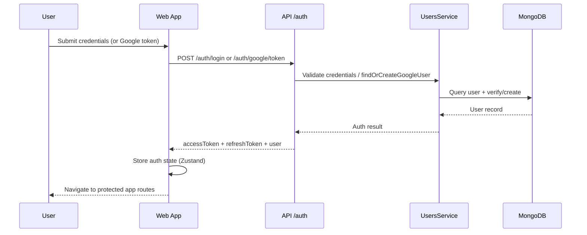
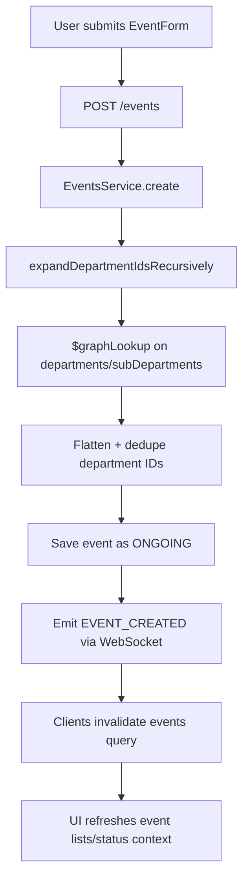
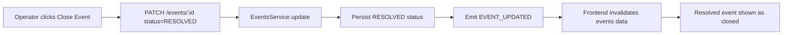
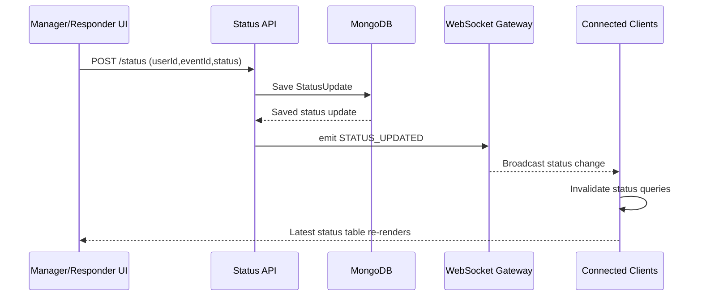
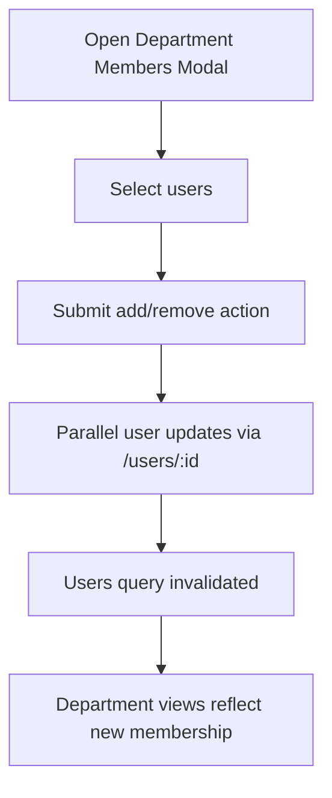
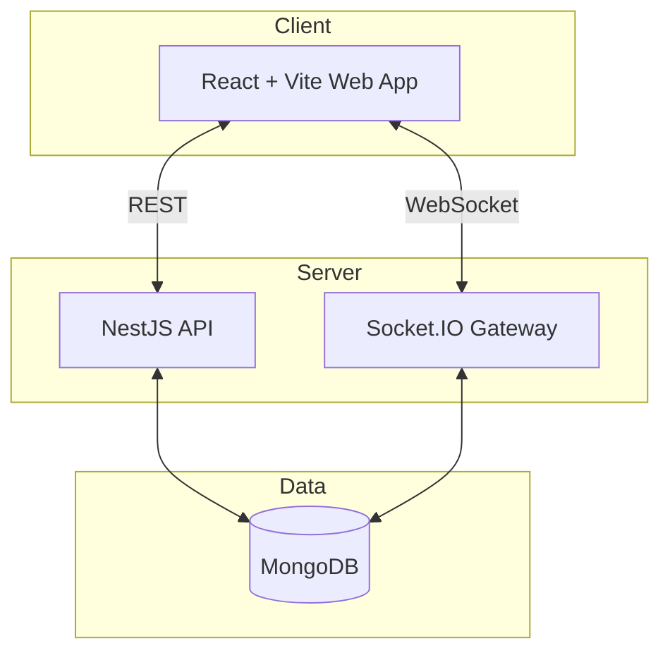

# EmergenSee

EmergenSee is a real-time emergency coordination platform for organizations that need to create incidents quickly, notify relevant responders, track responder safety status, and manage users/departments from a single system.  
Target users include operations/admin teams, department managers, and field responders.

## Table of Contents

- [System Purpose](#system-purpose)
- [Core Functionality](#core-functionality)
- [Process Workflows](#process-workflows)
- [System Architecture](#system-architecture)
- [Monorepo Structure](#monorepo-structure)
- [Setup & Installation](#setup--installation)
- [Environment Variables](#environment-variables)
- [Scripts](#scripts)
- [API & Realtime Interfaces](#api--realtime-interfaces)

## System Purpose

EmergenSee solves three operational problems end-to-end:

1. **Incident Coordination**: create and close emergency events with priority/type/location.
2. **Responder Accountability**: collect responder status updates (`SAFE`, `NEED_HELP`, `AWAY`, `UNKNOWN`) during active events.
3. **Organizational Control**: manage users, departments, and department membership with role-aware UI/API behavior.

## Core Functionality

### 1) Authentication & Session Management
- Email/password login and registration.
- Google Identity Services token login (`/auth/google/token`).
- JWT access + refresh token flow.
- Protected frontend routes with redirect to login when unauthenticated.

### 2) Event Management
- Create, edit, list, and resolve events.
- Event form captures type, priority, title, description, location, and related departments.
- Resolved events disable edit/close actions in UI.
- Real-time event updates via WebSocket broadcast.

### 3) Recursive Department Coverage for Events
- When an event is created/updated with departments, backend expands departments recursively to include nested sub-departments.
- Expansion is executed in MongoDB using `$graphLookup`.
- Events persist the flattened department scope for downstream status filtering/reporting.

### 4) Status Tracking (Safety Check Lifecycle)
- Status page shows active events and responder statuses.
- Department filter is scoped to the currently selected active event’s departments.
- Authorized users can submit responder statuses from action buttons.
- Latest status per user/event is displayed with timestamp.

### 5) Emergency Report Fast-Action Page
- If user belongs to a department related to an ongoing event, emergency report page is available.
- One-click status reporting for urgent scenarios (`SAFE` or `NEED_HELP`).

### 6) User Management
- Create, update, delete users.
- Filter users by department in UI.
- Department membership updates are supported from department member modal.

### 7) Department Management
- Create/update/delete departments.
- Assign admins and sub-departments.
- Manage department members through modal workflows.

### 8) Real-Time Synchronization
- Backend emits event/status updates over Socket.IO.
- Frontend WebSocket hooks invalidate React Query caches to auto-refresh screens.

## Process Workflows

### Authentication Flow



### Event Creation & Recursive Department Expansion



### Event Close Lifecycle



### Safety Check / Status Lifecycle



### Department Member Management Flow



## System Architecture

### Technology Stack

| Layer | Technology |
|---|---|
| Monorepo | Turborepo + pnpm workspaces |
| Frontend | React 18, Vite, TypeScript |
| Styling | Tailwind CSS |
| Frontend State | TanStack Query + Zustand |
| Forms/Validation | react-hook-form + Zod/shared DTO contracts |
| Backend | NestJS 10, TypeScript |
| Database | MongoDB + Mongoose |
| Realtime | Socket.IO (Nest gateway + web client) |
| API Docs | Swagger (`/docs`) |

### High-Level Architecture Diagram



### Frontend Component Architecture (Atomic-Inspired)

The frontend follows a layered component model:

- **UI primitives (`src/components/ui`)**: reusable low-level components such as `Button`, `Input`, `Label`, `Textarea`, `Badge`, `IconButton`, `FieldError`.
- **Common reusable blocks (`src/components/common`)**: higher-level shared widgets such as `GenericTable`, `Loader`, `ConfirmModal`.
- **Feature/domain components**: `EventForm`, `DepartmentForm`, `DepartmentMembersModal`, user form modules.
- **Pages (`src/pages`)** compose feature components and orchestrate queries/mutations.

### Backend Service-Based Architecture

Backend is organized by domain modules under `apps/api/src/services`:

- `auth` (login/register/refresh/google token)
- `users` (CRUD + google account linking)
- `events` (CRUD, nearby search, recursive department expansion)
- `status` (status updates and retrieval)
- `departments` (department hierarchy/admin structure)
- `websocket` (event/status broadcasts)

Each module follows NestJS separation of concerns:
- **Controller**: HTTP contract.
- **Service**: business logic.
- **Schema/DTO**: persistence and input contracts.

## Monorepo Structure

```text
apps/
  api/      # NestJS backend
  web/      # React + Vite frontend
packages/
  shared/   # shared types/schemas/constants
  ui/       # shared UI package
  eslint-config/
  tsconfig/
docs/       # extended project documentation
```

## Setup & Installation

### Prerequisites

- Node.js >= 20
- pnpm >= 8
- MongoDB (local or remote)

### 1) Install dependencies

```bash
pnpm install
```

### 2) Configure environment files

Create the following files from examples:

- `apps/api/.env`
- `apps/web/.env`

### 3) Start MongoDB

Option A: Docker

```bash
docker-compose up -d
```

Option B: local Mongo service.

### 4) Run in development

From repository root:

```bash
pnpm dev
```

Expected local endpoints:
- Web: `http://localhost:5173`
- API: `http://localhost:3001`
- Swagger: `http://localhost:3001/docs`

## Environment Variables

### API (`apps/api/.env`)

```env
PORT=3001
NODE_ENV=development
MONGODB_URI=mongodb://localhost:27017/emergensee
JWT_SECRET=your-super-secret-jwt-key-change-this-in-production
JWT_EXPIRES_IN=15m
JWT_REFRESH_SECRET=your-super-secret-refresh-key-change-this-in-production
JWT_REFRESH_EXPIRES_IN=7d
CORS_ORIGIN=http://localhost:5173
GOOGLE_CLIENT_ID=your-google-client-id
```

### Web (`apps/web/.env`)

```env
VITE_API_URL=http://localhost:3001
VITE_GOOGLE_CLIENT_ID=your-google-client-id
```

## Scripts

### Root

| Command | Description |
|---|---|
| `pnpm dev` | Run all apps in dev mode via Turborepo |
| `pnpm build` | Build all packages/apps |
| `pnpm test` | Run tests across workspace |
| `pnpm lint` | Lint workspace |
| `pnpm typecheck` | Type-check workspace |

### API (`apps/api`)

| Command | Description |
|---|---|
| `pnpm build` | Build NestJS API |
| `pnpm start` | Start API |
| `pnpm dev` | Start API in watch mode |
| `pnpm start:prod` | Run compiled API (`dist/main`) |
| `pnpm test` | Unit tests |
| `pnpm test:e2e` | E2E tests |

### Web (`apps/web`)

| Command | Description |
|---|---|
| `pnpm dev` | Start Vite dev server |
| `pnpm build` | Build web app |
| `pnpm preview` | Preview production build |
| `pnpm lint` | Lint frontend |
| `pnpm type-check` | TypeScript check |

## API & Realtime Interfaces

- REST base URL: `http://localhost:3001`
- Swagger docs: `http://localhost:3001/docs`
- Main API domains:
  - `/auth`
  - `/users`
  - `/events`
  - `/status`
  - `/departments`
- WebSocket event types include:
  - `EVENT_CREATED`
  - `EVENT_UPDATED`
  - `EVENT_DELETED`
  - `STATUS_UPDATED`
  - `CONNECTED` / `DISCONNECTED`

---

For deeper implementation details, see the `docs/` directory (`ARCHITECTURE.md`, `API.md`, `WEBSOCKET.md`, `DEVELOPMENT.md`, `SECURITY.md`).
